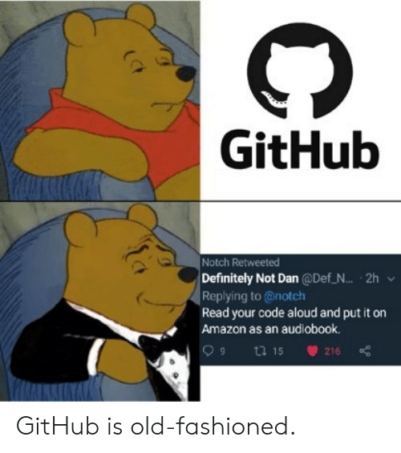
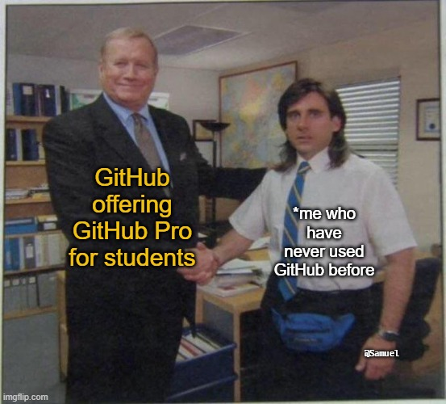

# **😋 Open Source Meme Catalogue**

Who doesn't like meme amirite? Here's a list you can contribute to and enjoy as well to save the best memes. It's all fun and games when it comes to <i>devs ranting</i> <b>Couple of devs sharing their love for open source software and memes</b>, what could go wrong?😜

<table style="width:1920px; border: black; margin: 0px auto;" class="skinny" cellspacing="0" cellpadding="0">
  <tr>
      <th>We love Open Source, Don't we?</th>
      <th></th> 
  </tr>
  <tr>
      <th></th> 
      <th>Here we go again...</th>
  </tr>
  <tr>
      <th>Truth be told :):</th>
      <th></th> 
  </tr>
  <tr>
      <th></th> 
      <th>FaMoUs</th>
  </tr>
  <tr>
      <th>It iss what it iss..</th>
      <th></th> 
  </tr>
  <tr>
      <th></th> 
      <th>We have feelings too :'(</th>
  </tr>
  <tr>
      <th>Devs be like...</th>
      <th></th> 
  </tr>
  <tr>
      <th></th> 
      <th>Easy peasy</th>
  </tr>
  <tr>
      <th>It's Big Brain Time</th>
      <th></th> 
  </tr>
  <tr>
      <th></th> 
      <th>It iss What it isss</th>
  </tr>
  <tr>
      <th>Its never Too late....And I mean NEVERRR</th>
      <th></th> 
  </tr>
</table>
  

**How to Contribute**
---

1. Clone repo and create a new branch: `$ git checkout https://github.com/CSI-SFIT/Getting-Started-With-Hacktoberfest -b name_for_new_branch`.
2. Add Image to the [Memes Folder](https://github.com/CSI-SFIT/Getting-Started-With-Hacktoberfest/tree/main/Meme%20Catalogue/Memes)
3. Follow the code style strictly.
4. Submit Pull Request with description of changes.

**Acknowledgements**
---

**CSI SFIT Team 2020 - 2021 :**
+ Chairperson : [@Delicia Fernandes](https://github.com/deliciafernandes)

 

  

 

  
  
  
  
  
  

