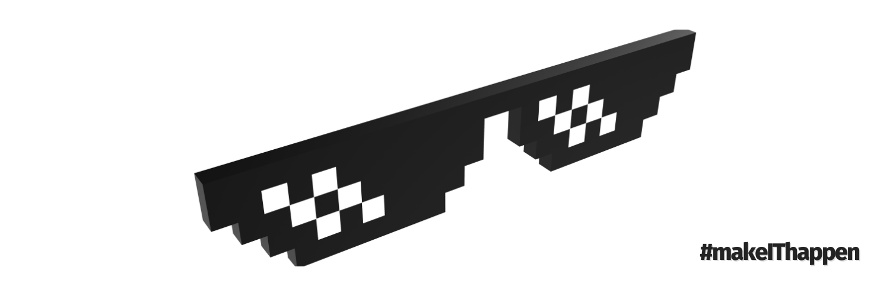
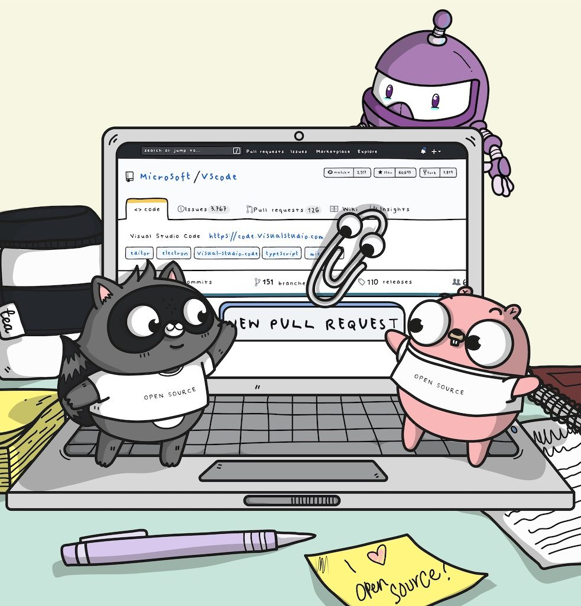
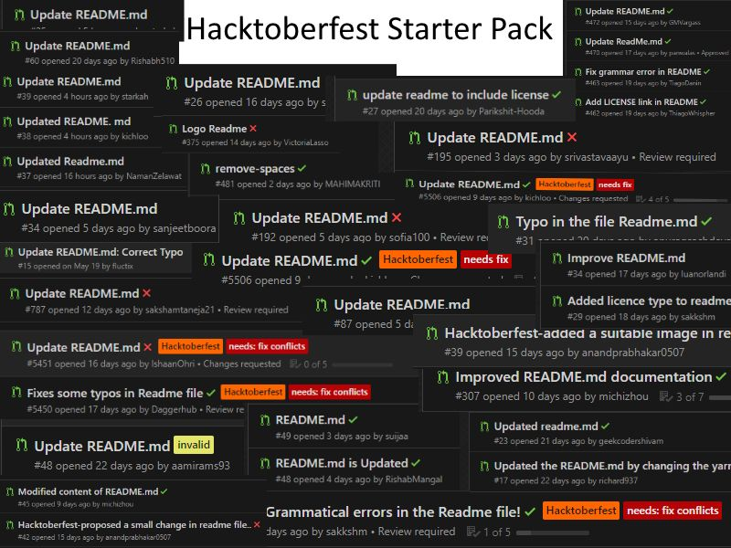
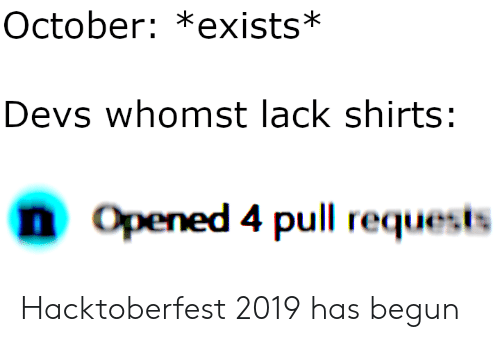
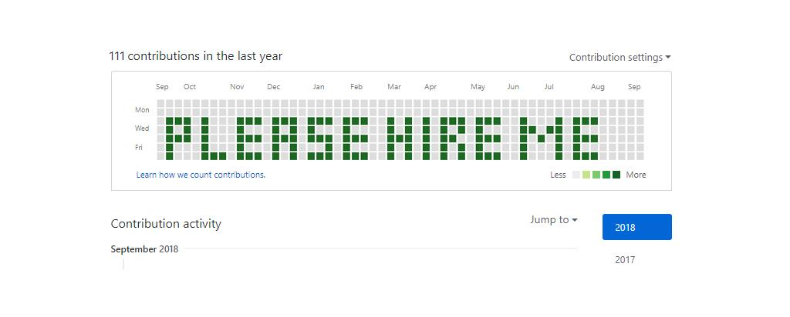
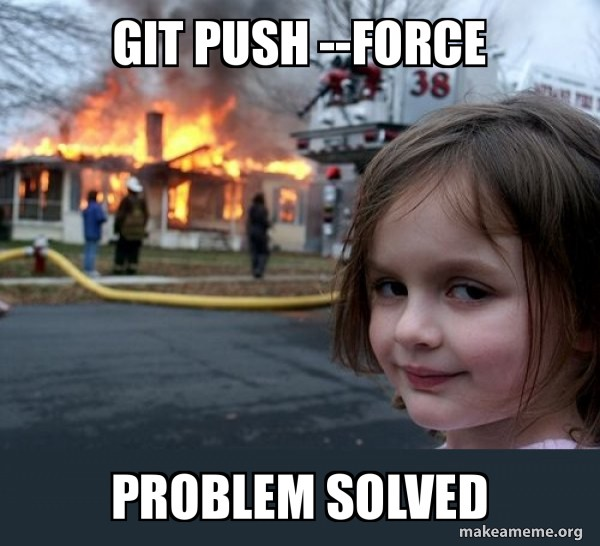

# **😋 Open Source Meme Catalogue**

  Who doesn't like meme amirite? Here's a list you can contribute to and enjoy as well to save the best memes. It's all fun and games when it comes to <i>devs ranting</i> <b>Couple of devs sharing their love for open source software and meme</b>, what could go wrong?😜

<table style="width:1920px; border: black; margin: 0px auto;" class="centerTable">
  <tr>
      <th></th> 
  </tr>
  <tr>
      <th></th> 
  </tr>
  <tr>
      <th></th> 
  </tr>
  <tr>
      <th></th> 
  </tr>
  <tr>
      <th></th> 
  </tr>
  <tr>
      <th></th> 
  </tr>
  <tr>
      <th></th> 
  </tr>
  <tr>
      <th></th> 
  </tr>
</table>
  

**How to Contribute**
---

1. Clone repo and create a new branch: `$ git checkout https://github.com/CSI-SFIT/Getting-Started-With-Hacktoberfest -b name_for_new_branch`.
2. Add Image to the [Meme Catalogue Folder](https://github.com/deliciafernandes/Getting-Started-With-Hacktoberfest/tree/main/Meme%20Catalogue)
3. Follow the code style strictly.
4. Submit Pull Request with description of changes.

**Acknowledgements**
---

**CSI SFIT Team 2020 - 2021 :**
+ Chairperson : [@Delicia Fernandes](https://github.com/deliciafernandes)

 

  

