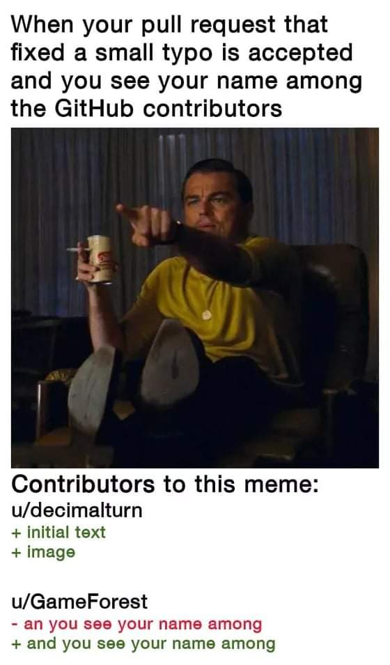

# **😋 Catalog of memes**

  Who doesn't like meme amirite? Here's a list you can contribute to and enjoy as well to save the best memes. It's all fun and games when it comes to ***devs ranting***.
   **Couple of devs sharing their love for open source software and meme**, what could go wrong?😜

   
  
    
  
    
  
    
  
    
  
    
  
    
  
    
  
    

**How to Contribute**
---

1. Clone repo and create a new branch: `$ git checkout https://github.com/CSI-SFIT/Getting-Started-With-Hacktoberfest -b name_for_new_branch`.
2. Add Image to the [Meme Catalogue Folder](https://github.com/deliciafernandes/Getting-Started-With-Hacktoberfest/tree/main/Meme%20Catalogue)
3. Follow the code style strictly.
4. Submit Pull Request with description of changes.
