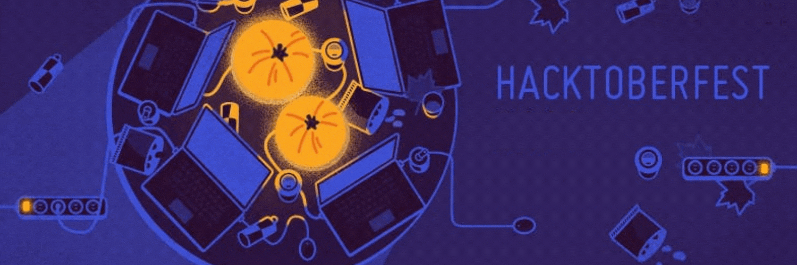
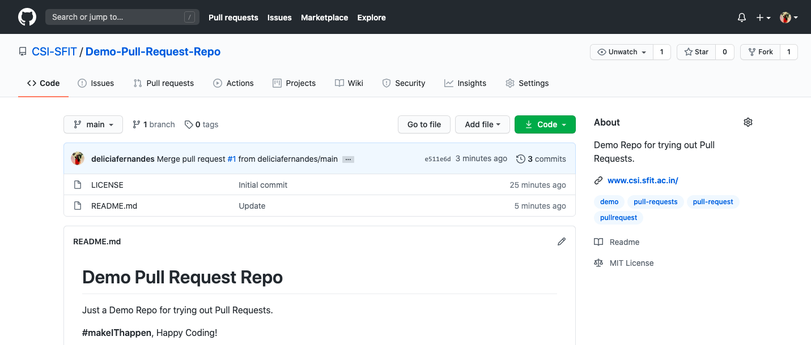
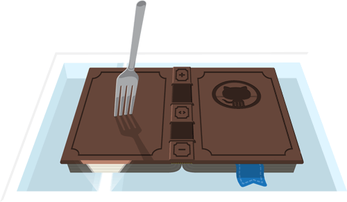
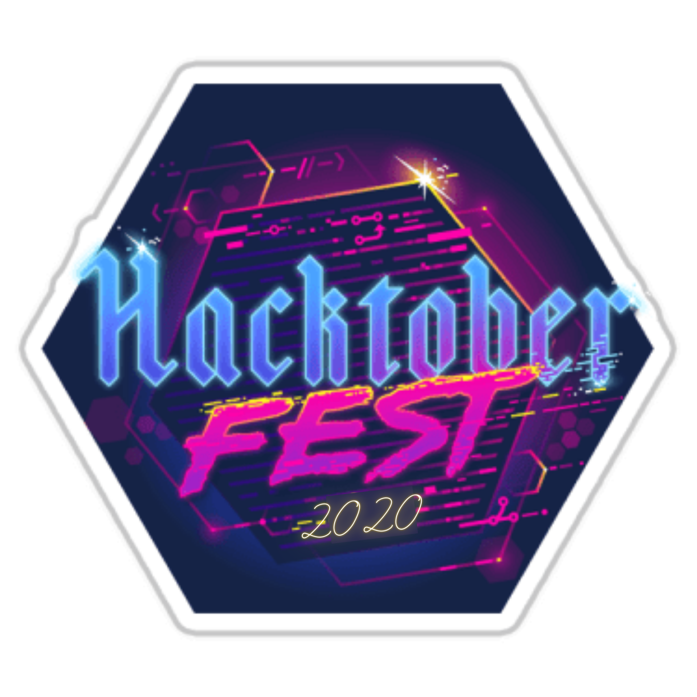

# ⚡  Getting Started With Hacktoberfest

<b>Getting Started With Hacktoberfest With CSI</b>

 

# Table of Contents
* <a href="#What is Hacktoberfest?">What is Hacktoberfest?</a>
* <a href="#Requirements to Enter">Requirements to Enter</a>
* <a href="#How to make a Pull request">How to make a Pull request</a>
* <a href="#Let's get to work!">Let's get to work!</a>
* <a href="#Qualified? Check to find out!">Qualified? Check to find out!</a>
* <a href="#Newbie to Open Source?">Newbie to Open Source?</a>
* <a href="#What Hacktoberfest Truly Means">What Hacktoberfest Truly Means</a>
* <a href="https://github.com/CSI-SFIT/Getting-Started-With-Hacktoberfest/tree/main/Meme%20Catalogue">Open Source Meme Catalogue</a>
---

### <a name="What is Hacktoberfest?">🤔 What is Hacktoberfest?</a>

**[Hacktoberfest](https://hacktoberfest.digitalocean.com/)** is a month-long celebration of open source software run by DigitalOcean in partnership with GitHub and Twilio, open to everyone in our global community!. Every October, Digital Ocean and GitHub ship out free Hacktoberfest shirts to thousands of people around the world. As long as you registered for Hacktoberfest, you’ll still get some free stickers in the mail. So it’s still worth registering, even if you’re too busy to participate.

 Whether you're a developer, student learning to code, event host, or company of any size, you can help drive growth of open source and make positive contributions to an ever-growing community. All backgrounds and skill levels are encouraged to complete the challenge.

---

### <a name="Requirements to Enter">🧐 Requirements to Enter:</a>

* Register for [Hacktoberfest](https://hacktoberfest.digitalocean.com/.
 You can sign up anytime between October 1 and October 31.
* You need a [GitHub](https://github.com/) account. 
 If you don’t have one yet, you can  [create one for free in just a few minutes](https://github.com/join).
* Four Pull requests must be submitted to  **any GitHub-hosted repositories/projects.**
* The pull request must contain commits you made yourself.
* Pull requests reported by maintainers as spam or that are automated will be marked as invalid and won’t count towards the shirt.
---

### <a name="How to make a Pull request">🤭 How to make a Pull request</a>

So, you know how to use Git and have a GitHub account yourself. You have a [GitHub](https://github.com/) repo and can push to it. All is well. But how do you contribute to other people's GitHub projects? 

**Creating a pull request**
1. When you want to work on a GitHub project, the first step is to fork a repo.
 Use [our demo pull request repo](https://github.com/CSI-SFIT/Demo-Pull-Request-Repo) to try it out.

2. Once there, click on the **Fork** button in the top-right corner.
 This creates a new copy of my demo repo under your GitHub user account with a URL like:
`https://github.com/<YourUserName>/Demo-Pull-Request-Repo`  
 **The copy includes all the code, branches, and commits from the original repo.**

3. Next, clone the repo by opening the terminal on your computer and running the command:
`git clone https://github.com/<YourUserName>/Demo-Pull-Request-Repo`

4. Once the repo is cloned, you need to create a new branch by issuing the command:
`git checkout -b new_branch_for_new_feature`

5. Create a new remote for the upstream repo with the command:
 `git remote add upstream https://github.com/<YourUserName>/Demo-Pull-Request-Repo`
 In this case, "upstream repo" refers to the original repo you created your fork from.
 Now you can make changes to the code, commit and push them.

6. Once you push the changes to your repo, the **Compare & pull request** button will appear in GitHub.

7. Open a pull request by clicking the **Create pull request** button.
 This allows the repo's maintainers to review your contribution. From here, they can merge it if it is good, or they may ask you to make some changes.

**In summary**, if you want to contribute to a project, the simplest way is to:

1.  Find a project you want to contribute to and Fork it
2.  Clone it to your local system
3.  Make a new branch
4.  Make your changes
5.  Push it back to your repo
6.  Click the  **Compare & pull request**  button
7.  Click  **Create pull request**  to open a new pull request

If the reviewers ask for changes, repeat steps 4 and 5 to add more commits to your pull request.

---

### <a name="Let's get to work!">😄 Let's get to work!</a>

Now all you gotta do is make four more pull requests to any open source project you want hosted on Github and contribute anything between **October 1 to October 31 midnight in 2020.**  
It doesn’t need to be code. It can be even documentation or even a spelling fix but meaningful. 
You will find plenty of issues labeled with [Hacktoberfest](https://github.com/search?q=label%3Ahacktoberfest+state%3Aopen&type=Issues) or  [good-first-issue](https://github.com/search?q=label%3Agood-first-issue+state%3Aopen&type=Issues) etc. on Github. These will be the simple ones most probably and easy to fix.

------

### <a name="Qualified? Check to find out!">🥰 Qualified? Check to find out!</a>
Once you’ve signed up for Hacktoberfest, you can check your progress on the [Hacktoberfest website](https://hacktoberfest.digitalocean.com/).  

**Still have questions?** That's alright, check out the [FAQ](https://hacktoberfest.digitalocean.com/faq) section to learn more, go ***git*** it.

---

### <a name="Newbie to Open Source?">😌 Newbie to Open Source?</a>

Hacktoberfest's plain objective is:
> Support open source and earn a limited edition T-shirt!

But, it’s not just about the t-shirts or stickers but about **supporting free and open source software**. It's about celebrating open source, and giving it back. If you’ve never contributed to open source before, this is the perfect time to get started because Hacktoberfest provides a large list of available contribution opportunities (and yes, there are always **plenty** for beginners too).
  
Making that first leap into open source is an intimidating endeavor. Knowing where to start is extremely challenging because of how open-ended open source can be. This is especially the case for junior developers. So then, how _does_ one actually get started with open source?

**Let's start at your first contribution shall we?**
- [🚀✨ Help beginners to contribute to open source projects](https://github.com/firstcontributions/first-contributions)
This is a Github repo  providing guidance & simplifying the way beginners make their first contribution. If you are looking to make your first contribution, click on now!
- [Awesome First PR Opportunities](https://github.com/mungell/awesome-for-beginners) 
A list of awesome beginner-friendly projects.
A hands-on tutorial that walks you through contributions workflow on GitHub. When you complete the tutorial, you have made a contribution to the same project.
- [First Timers Only](https://kentcdodds.com/blog/first-timers-only)
A blog post for your firsts in ***code***.
- [Up for Grabs](https://up-for-grabs.net/#/)
A list of projects which have curated tasks specifically for new contributors. These are a great way to get started with a project, or to help share the load of working on open source projects. They label those projects with things like “up-for-grabs”, “jump-in” or “help wanted.”
- [goodfirstissues.com](https://goodfirstissues.com/) is a site that aggregates _the latest issues_ with the label “Good First Issue”, which is a GitHub feature for finding easy issues to tackle (see [here](https://github.blog/2020-01-22-how-we-built-good-first-issues)).
[goodfirstissues.com](https://goodfirstissues.com/) is a site that aggregates _the latest issues_ with the label “Good First Issue”, which is a GitHub feature for finding easy issues to tackle (see [here](https://github.blog/2020-01-22-how-we-built-good-first-issues)).
-   [goodfirstissue.dev](https://goodfirstissue.dev/)  curates easy pickings from popular open-source projects, and helps you make your first contribution to open-source.
-   [CodeTriage](https://www.codetriage.com/)  helps you subscribe to your favorite open-source projects and get a new open issue from them in your inbox every day.

**Extra Good Stuff you should look at:**
- [5 ways to contribute to open source during Hacktoberfest](https://opensource.com/article/19/10/contribute-open-source-hacktoberfest)
- Here’s [a more detailed guide to contributing to open source](https://github.com/freeCodeCamp/how-to-contribute-to-open-source), if you’re feeling adventurous.

---

### <a name="What Hacktoberfest Truly Means">🤨 What Hacktoberfest Truly Means</a>

Not all treasures are material! This is a **key milestone** in your young career: open source contributions! To get the opportunity to engage more deeply with  local developer community through a number of Hacktoberfest Meetup events as well as contribute for a greater cause.  
By putting on events such as these, it promotes and generates involvement in one's own community, whether it be online, in person. A great opportunity to poke around in the inner workings of major open-source libraries. And well, formally **introduce yourself to the world of open source by giving back**.

---

**How to Contribute**
---

1. Clone repo and create a new branch: `$ git checkout https://github.com/CSI-SFIT/Getting-Started-With-Hacktoberfest -b name_for_new_branch`.
2. Make changes and test.
3. Submit Pull Request with comprehensive description of changes.

**Acknowledgements**
---

**CSI SFIT Team 2020 - 2021 :**
+ Chairperson : [@Delicia Fernandes](https://github.com/deliciafernandes)

 

  

 

  
  
  
  
  
  

